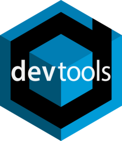

# devtools <a href="https://devtools.r-lib.org/"></a>

<!-- badges: start -->
[](https://github.com/r-lib/devtools/actions/workflows/R-CMD-check.yaml)
[](https://cran.r-project.org/package=devtools)
[](https://app.codecov.io/gh/r-lib/devtools)
<!-- badges: end -->

The aim of devtools is to make package development easier by providing R
functions that simplify and expedite common tasks. [R
Packages](https://r-pkgs.org/) is a book based around this workflow.

## Installation

```r
# Install devtools from CRAN
install.packages("devtools")

# Or the development version from GitHub:
# install.packages("pak")
pak::pak("r-lib/devtools")
```

## Cheatsheet

<a href="https://raw.githubusercontent.com/rstudio/cheatsheets/main/package-development.pdf"></a>


## Usage

All devtools functions accept a path as an argument, e.g.
`load_all("path/to/mypkg")`. If you don't specify a path, devtools will
look in the current working directory - this is a recommended practice.

### Frequent development tasks:

* `load_all()` simulates installing and reloading your package, loading R code
  in `R/`, compiled shared objects in `src/` and data files in `data/`. During
  development you would usually want to access all functions (even un-exported
  internal ones) so `load_all()` works as if all functions were exported in the
  package `NAMESPACE`.

* `document()` updates generated documentation in `man/`, file collation and
  `NAMESPACE`.

* `test()` reloads your code with `load_all()`, then runs all `testthat` tests.

* `test_coverage()` runs test coverage on your package with
  [covr](https://github.com/r-lib/covr). This makes it easy to see what parts of your
  package could use more tests!

### Building and installing:

* `install()` reinstalls the package, detaches the currently loaded version
  then reloads the new version with `library()`. Reloading a package is not
  guaranteed to work: see the documentation for `unload()` for caveats.

* `build()` builds a package file from package sources. You can use it to build
  a binary version of your package.

* `install_*` functions install an R package:
   * `install_github()` from GitHub
   * `install_gitlab()` from GitLab
   * `install_bitbucket()` from Bitbucket
   * `install_url()` from an arbitrary url
   * `install_git()` and `install_svn()` from an arbitrary git or SVN repository
   * `install_local()` from a local file on disk
   * `install_version()` from a specific version on CRAN

* `update_packages()` updates a package to the latest version. This works
  both on packages installed from CRAN as well as those installed from any of
  the `install_*` functions.

### Check and release:

* `check()` updates the documentation, then builds and checks the package locally.
  `check_win()` checks a package using
  [win-builder](https://win-builder.r-project.org/), and `check_rhub()` checks a package using
  [r-hub](https://log.r-hub.io/). This allows you to easily check
  your package on all systems CRAN uses before submission.

* `release()` makes sure everything is ok with your package (including asking
  you a number of questions), then builds and uploads to CRAN.

## Learning more

R package development can be intimidating, however there are now a number of
valuable resources to help!

<a href="https://r-pkgs.org"></a>

1. R Packages is a book that gives a comprehensive treatment of all common parts
   of package development and uses devtools throughout.
    * The first edition is no longer available online, but it is still in print. Note that it has grown somewhat out of sync with the current version of devtools.
    * A second edition that reflects the current state of devtools, plus new topics such as package websites and GitHub Actions, is available at <https://r-pkgs.org> and in paperback format.
    * The [Whole Game](https://r-pkgs.org/whole-game.html) and
      [Package structure](https://r-pkgs.org/package-structure-state.html) chapters
      make great places to start.

2. [Posit Community - package
   development](https://forum.posit.co/c/package-development/11)
   is a great place to ask specific questions related to package development.

3. [rOpenSci packages](https://devguide.ropensci.org/) has
   extensive documentation on best practices for R packages looking to be
   contributed to rOpenSci, but also very useful general recommendations
   for package authors.

4. There are a number of fantastic blog posts on writing your first package, including
   - [Writing an R package from scratch - Hilary Parker](https://hilaryparker.com/2014/04/29/writing-an-r-package-from-scratch/)
   - [How to develop good R packages - Maëlle Salmon](https://masalmon.eu/2017/12/11/goodrpackages/)
   - [Making your first R package - Fong Chun Chan](https://tinyheero.github.io/jekyll/update/2015/07/26/making-your-first-R-package.html)
   - [Writing an R package from scratch - Tomas Westlake](https://r-mageddon.netlify.app/post/writing-an-r-package-from-scratch/)

5. [Writing R
   Extensions](https://cran.r-project.org/doc/manuals/r-release/R-exts.html) is
   the exhaustive, canonical reference for writing R packages, maintained by
   the R core developers.

## Conscious uncoupling

devtools started off as a lean-and-mean package to facilitate local package
development, but over the years it accumulated more and more functionality.
devtools has undergone a [conscious
uncoupling](https://web.archive.org/web/20140326060230/https://www.goop.com/journal/be/conscious-uncoupling)
to split out functionality into smaller, more tightly focussed packages. This
includes:

* [testthat](https://github.com/r-lib/testthat): Writing and running tests
  (i.e. `test()`).

* [roxygen2](https://github.com/r-lib/roxygen2): Function and package documentation
  (i.e. `document()`).

* [remotes](https://github.com/r-lib/remotes): Installing packages (i.e.
  `install_github()`).

* [pkgbuild](https://github.com/r-lib/pkgbuild): Building binary packages
  (including checking if build tools are available) (i.e. `build()`).

* [pkgload](https://github.com/r-lib/pkgload): Simulating package loading (i.e.
  `load_all()`).

* [rcmdcheck](https://github.com/r-lib/rcmdcheck): Running R CMD check and
  reporting the results (i.e. `check()`).

* [revdepcheck](https://github.com/r-lib/revdepcheck): Running R CMD check on
  all reverse dependencies, and figuring out what's changed since the last CRAN
  release (i.e. `revdep_check()`).

* [sessioninfo](https://github.com/r-lib/sessioninfo): R session info (i.e.
  `session_info()`).

* [usethis](https://github.com/r-lib/usethis): Automating package setup (i.e.
  `use_test()`).

Generally, you would not need to worry about these different packages, because
devtools installs all of them automatically. You will need to care, however, if
you're filing a bug because reporting it at the correct place will lead to a
speedier resolution.

You may also need to care if you are trying to use some devtools functionality
in your own package or deployed application. Generally in these cases it
is better to depend on the particular package directly rather than depend on devtools,
e.g. use `sessioninfo::session_info()` rather than `devtools::session_info()`,
or `remotes::install_github()` vs `devtools::install_github()`.

However for day to day development we recommend you continue to use
`library(devtools)` to quickly load all needed development tools, just like
`library(tidyverse)` quickly loads all the tools necessary for data exploration
and visualization.

## Code of conduct

Please note that the devtools project is released with a [Contributor Code of Conduct](https://github.com/r-lib/devtools/blob/main/.github/CODE_OF_CONDUCT.md). By contributing to this project, you agree to abide by its terms.
